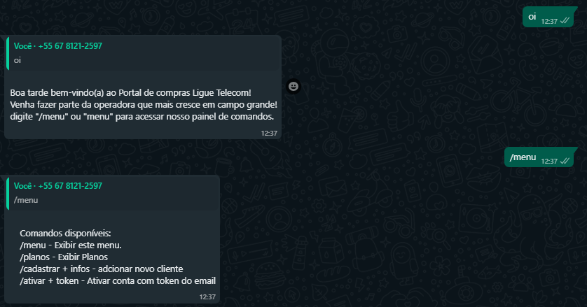
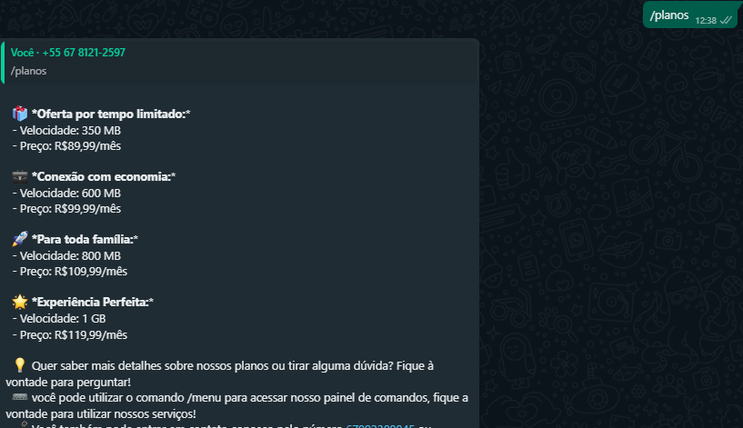
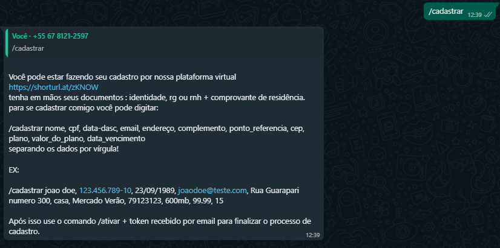
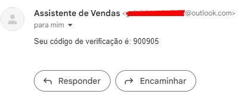
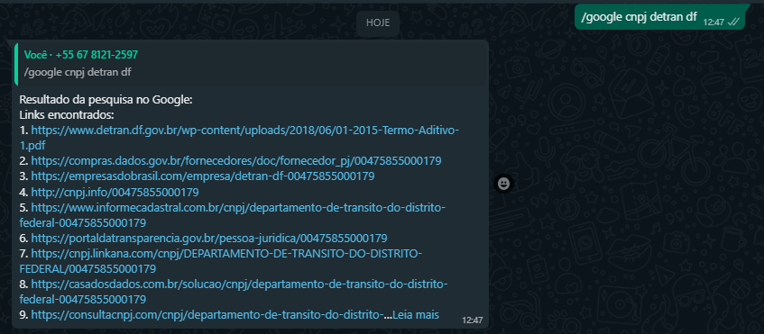
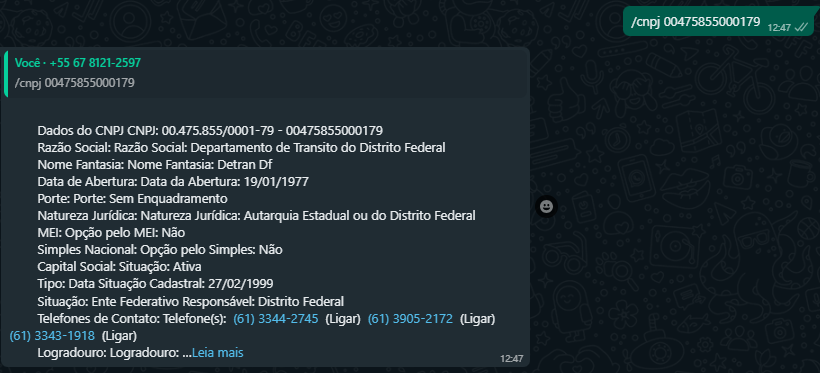

# WhatsappBot

Automação desenvolvida em NodeJs  atualizado dia 20/08/2023  criado para automatizar tarefas este bot é capaz de ler e responder mensagens, anotar pedidos, executar comandos e muito mais! 

 caso tenha interesse em adquirir a ferramenta entrar em contato em <a href="https://wa.me/5567992389945">Gabriel SecDevDF</a>, <a href="https://t.me/secdevdf">Telegram </a> ou <a href="https://discord.gg/Uq2mgCSZA2">Discord </a>

  

  

  
 caso tenha interesse em adquirir a ferramenta entrar em contato em <a href="https://wa.me/5567992389945">Gabriel SecDevDF</a>, </a><a href="https://t.me/secdevdf">Telegram </a> ou <a href="https://discord.gg/Uq2mgCSZA2">Discord </a>

