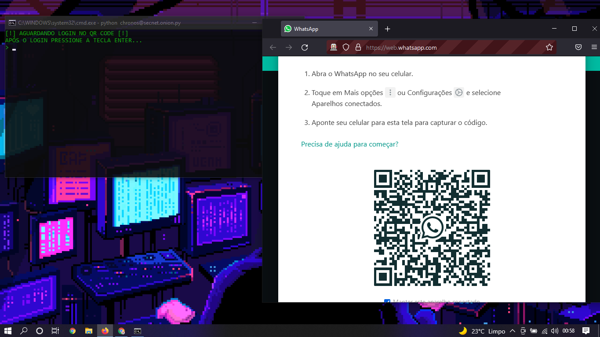
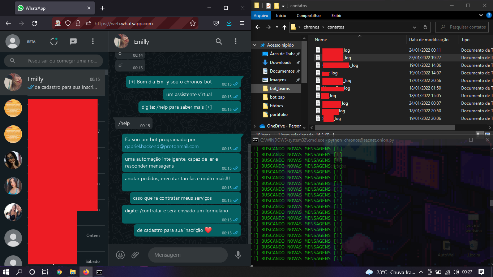
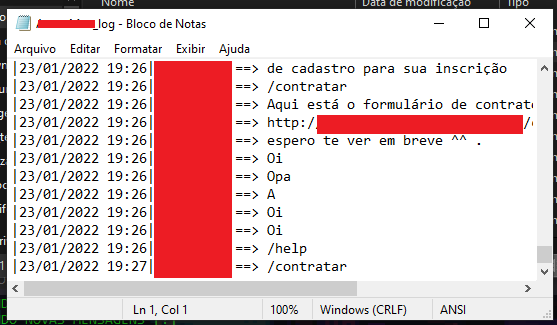

# WhatsappBot

Automação programada em Python3.9.10 atualizado dia 25/01/2022  criado para automatizar tarefas, anotar pedidos, executar comandos e muito mais! 

  
[!]========================================================================================[!]

  
[!]========================================================================================[!]

  
 caso tenha interesse em adquirir a ferramenta entrar em contato no <a href="https://wa.me/+5561999729684">whatsapp</a>

